# Problem-surface map

What named problems of physics this repository takes a defensible
position on, tiered by the possibility-discipline discriminator
(`canonical_glossary.md` §8). Generated by
`scripts/build_problem_map.py` from `problem/PROBLEM_MAP.yml`;
every doc, claim, and script reference below is machine-checked
against `MANIFEST.yml`, the derivations directory, and
`docs/corpus-index.json`. Do not edit by hand.

## Tier 1 — substrate-forced (the firm lines)

### Cosmological constant problem — *the worst prediction in physics (~120 orders of magnitude)*

The magnitude of Λ is derived, not tuned: Λ·ℓ_P² = 13⁻¹⁰⁸/12 = 3/R² with R = 6·13⁵⁴ from Gaussian-lattice cell counting (0.1% in the exponent, 0.48% on R). The 120-order "catastrophe" is an artifact of computing vacuum energy in a framework where Λ is an input; here it is a counting output.

**MANIFEST claims:** `lambda_planck`, `hierarchy`

**Docs:** [`hierarchy_gaussian_lattice`](../sync_cost/derivations/hierarchy_gaussian_lattice.md), [`exponent`](../sync_cost/derivations/exponent.md), [`lesson_cosmological_constant`](../sync_cost/derivations/lesson_cosmological_constant.md)

**Test / falsifier:** Tighter joint (Λ, H₀) determinations move R; the identity fails if the exponent drifts beyond its 0.1% window.

### Dark energy fraction / cosmic coincidence problem — *why is Ω_Λ order unity now?*

Ω_Λ = 13/19 (0.07σ vs Planck 2018), refined to 181/264 = 0.68561 (0.13%) under the two-component closure with w₊ = 13/14 from the Γ₀(6) cusp-1/2 ground state. The fraction is combinatorial (Farey-6 partition + Z₂ rep theory), so no coincidence remains to explain.

**MANIFEST claims:** `dark_energy`, `dark_energy_fraction_two_component`

**Docs:** [`omega_partition_combinatorial`](../sync_cost/derivations/omega_partition_combinatorial.md), [`farey_partition`](../sync_cost/derivations/farey_partition.md), [`baryon_fraction`](../sync_cost/derivations/baryon_fraction.md), [`omega_b_alpha_beta_closure`](../sync_cost/derivations/omega_b_alpha_beta_closure.md), [`psl2z_subgroup_phase_b`](../sync_cost/derivations/psl2z_subgroup_phase_b.md), [`L1_substrate_cusp_ground_state`](../sync_cost/derivations/L1_substrate_cusp_ground_state.md), [`w_plus_formalization`](../sync_cost/derivations/w_plus_formalization.md)

**Test / falsifier:** Euclid/DESI refinement of Ω_Λ outside the 13/19 window falsifies the F₆ partition; w = −1 (+ small twist-breathing correction) testable ~2028.

### Dark matter and baryon fractions — *what fixes Ω_DM : Ω_b ≈ 5.4?*

Ω_DM = 35/132 (0.06%), Ω_b = 13/264 (0.12%), Ω_DM/Ω_b = 70/13 (0.6%) from the same 13:5:1/19 partition plus the two-component closure. The dark-matter abundance question is answered at the fraction level (what shares exist), not the particle level.

**MANIFEST claims:** `dark_matter_fraction`, `baryon_fraction`, `dm_baryon_ratio`

**Docs:** [`baryon_fraction`](../sync_cost/derivations/baryon_fraction.md), [`omega_partition_combinatorial`](../sync_cost/derivations/omega_partition_combinatorial.md), [`omega_b_alpha_beta_closure`](../sync_cost/derivations/omega_b_alpha_beta_closure.md), [`L1_substrate_cusp_ground_state`](../sync_cost/derivations/L1_substrate_cusp_ground_state.md)

**Caveat:** No particle candidate is offered; the framework's dark-matter story is fractional/combinatorial, with galactic phenomenology handled by the a₀ row below.

### Strong CP problem

θ_QCD = 0 proposed via Pin⁺(3) topology on the Klein bottle (D45). Conditional, not established: the argument runs on the K² configuration space (itself a conditional premise) and its eta-invariant-vanishing step is an unverified import (MANIFEST `strong_cp`, retracted from Class 5 on 2026-08-12). If both hold, strong CP dissolves with no axion and no tuning.

**MANIFEST claims:** `strong_cp`

**Docs:** [`coupling_scales`](../sync_cost/derivations/coupling_scales.md)

**Test / falsifier:** Any measurement of θ ≠ 0 falsifies; discovery of a QCD axion doing the resolving would undercut the mechanism.

### Quantum measurement problem — *often called the most embarrassing problem in physics*

Dissolved, not solved-by-interpretation: the substrate carries no projection postulate to reconcile with unitary evolution. Collapse is fidelity-bounded self-measurement; the preferred basis is basin selection (the saddle-node normal form fixes each context's basis structurally); the Born exponent 2 is saddle-node universality, not an axiom.

**MANIFEST claims:** `born_rule`

**Docs:** [`collapse_dissolution`](../sync_cost/derivations/collapse_dissolution.md), [`preferred_basis_dissolution`](../sync_cost/derivations/preferred_basis_dissolution.md), [`lesson_forced_basin_selection`](../sync_cost/derivations/lesson_forced_basin_selection.md), [`figure_eight`](../sync_cost/derivations/figure_eight.md), [`born_rule`](../sync_cost/derivations/born_rule.md), [`a1_from_saddle_node`](../sync_cost/derivations/a1_from_saddle_node.md), [`fidelity_bound`](../sync_cost/derivations/fidelity_bound.md)

**Test / falsifier:** Collapse duration τ ∝ 1/√ε with τΔω = const, and Zeno suppression, from the fidelity bound — testable in cavity QED / superconducting qubits.

**Caveat:** The dissolution docs are Class-3 articulations resting on the Class-5 Born-rule apparatus; the falsifiable content lives in the collapse-timing predictions.

### Bell nonlocality / EPR — *how can correlations violate Bell bounds without signaling?*

Bell-violating, non-signaling statistics at exactly the Tsirelson bound (and Mermin |M| = 4 for GHZ) are derived substrate-internally. Bell's no-go is evaded honestly: the conserved Q mod 2 is a global topological invariant of the Klein-bottle context window, not a shared local hidden variable λ.

**Docs:** [`epr_bell_assembly_theorem`](../sync_cost/derivations/epr_bell_assembly_theorem.md), [`bell_bounds_from_substrate`](../sync_cost/derivations/bell_bounds_from_substrate.md), [`ghz_from_substrate`](../sync_cost/derivations/ghz_from_substrate.md), [`q_mod2_conservation_theorem`](../sync_cost/derivations/q_mod2_conservation_theorem.md)

**Caveat:** Reproduces QM's bounds rather than predicting deviations from them; the claim is structural explanation, not new statistics.

### Dimensionality and signature of spacetime — *why 3+1 and why Lorentz?*

d = 3 from the SL(2,ℝ) Lie-group dimension forced by the mediant's SL(2,ℤ) symmetry (D14); Minkowski signature and Spin(3,1) from the Klein-bottle Cl(3,1) construction (D32, D15). Exact, structural.

**MANIFEST claims:** `spatial_dimension`, `lorentz`

**Docs:** [`three_dimensions`](../sync_cost/derivations/three_dimensions.md), [`minkowski_signature`](../sync_cost/derivations/minkowski_signature.md), [`lie_group_characterization`](../sync_cost/derivations/lie_group_characterization.md)

### Origin of the Standard Model gauge group — *why SU(3)×SU(2)×U(1), why do anomalies cancel?*

SU(3)×SU(2)×U(1) from the Klein-bottle mode lattice Z₆ = Z₂ × Z₃ (D41/D42); Yang-Mills dynamics unique via Utiyama + Cartan given the substrate's kinematics (gauge-sector Lovelock); all 6 SM anomaly conditions verified as substrate mode-count identities; charge quantization via Gell-Mann–Nishijima (D43).

**MANIFEST claims:** `gauge_group`, `anomaly_cancellation`

**Docs:** [`gauge_sector_lovelock`](../sync_cost/derivations/gauge_sector_lovelock.md), [`discrete_gauge_resolution`](../sync_cost/derivations/discrete_gauge_resolution.md), [`gell_mann_nishijima`](../sync_cost/derivations/gell_mann_nishijima.md)

**Scripts:** `anomaly_check.py`, `fiber_bundle.py`, `xor_asymmetry.py`

### Unification of general relativity and quantum mechanics

GR and QM are the two continuum limits of one substrate: Einstein's equations unique (Lovelock, D13) at the locked K=1 limit, Schrödinger structure at K<1, with the K=1 ↔ K<1 decoupling non-smooth — which is why the two theories resist merger in the continuum and why each needs its own anchor.

**Docs:** [`einstein_from_kuramoto`](../sync_cost/derivations/einstein_from_kuramoto.md), [`continuum_limits`](../sync_cost/derivations/continuum_limits.md), [`gr_qm_unification_synthesis`](../sync_cost/derivations/gr_qm_unification_synthesis.md), [`lesson_epr_gr_qm_unification`](../sync_cost/derivations/lesson_epr_gr_qm_unification.md), [`PROOF_A_gravity`](../sync_cost/derivations/PROOF_A_gravity.md), [`PROOF_B_quantum`](../sync_cost/derivations/PROOF_B_quantum.md)

**Caveat:** Unification is at the substrate layer; no quantum-gravity phenomenology (e.g. graviton scattering) is predicted.

### MOND scale and the radial acceleration relation — *why a₀ ≈ cH₀ (the a₀ coincidence)*

a₀ = cH₀/(2π) structurally from Λ (both scales are set by Λ, so the coincidence is an identity), and the RAR interpolating shape with its scatter pattern derived from the fidelity bound rather than fit.

**MANIFEST claims:** `mond_scale`

**Docs:** [`a0_threshold`](../sync_cost/derivations/a0_threshold.md), [`fidelity_bound`](../sync_cost/derivations/fidelity_bound.md), [`high_z_mond`](../sync_cost/derivations/high_z_mond.md)

**Test / falsifier:** a₀(z) = cH(z)/(2π) at high z (GEKO/CRISTAL ~2025–2030): z≈5 galaxies Newtonian at z=0 should sit in the transition zone; post-merger RAR re-establishment on ~1/H(z).

### Inflation duration (e-fold count)

N_efolds = √5/(2/57) ≈ 63.7, with the cadence 2/57 = 2/(q₃·19_Λ) uniquely forced by the K(t) closure (Q mod 2 mediant projection + structural integers + bicone-golden Z₂ bridge). Does not consume observed n_s.

**MANIFEST claims:** `efolds`

**Docs:** [`k_of_t_residual_disposition`](../sync_cost/derivations/k_of_t_residual_disposition.md), [`bicone_golden_z2_identification`](../sync_cost/derivations/bicone_golden_z2_identification.md), [`q_mod2_mediant_projection`](../sync_cost/derivations/q_mod2_mediant_projection.md), [`predictions_horizon_2026`](../sync_cost/derivations/predictions_horizon_2026.md)

**Test / falsifier:** Falsified outside [62, 66] at CMB-S4 (~2028+) / LiteBIRD (~2032) precision. Sits at the upper edge of standard slow-roll estimates, so it is discriminating.

### Near-scale-invariance of the primordial spectrum — *why n_s ≈ 0.965?*

n_s = 0.963–0.966 from devil's-staircase self-similarity at the golden-ratio winding (φ² zoom structure), replacing the earlier cost-function derivation whose running sign was a theorem-level failure.

**MANIFEST claims:** `spectral_tilt`

**Docs:** [`spectral_tilt_reframed`](../sync_cost/derivations/spectral_tilt_reframed.md), [`spectral_tilt`](../sync_cost/derivations/spectral_tilt.md)

**Caveat:** Reconciled 2026-07-21: the "free pivot x_*" belonged to the superseded cost-function derivation; the live staircase mechanism is structural. One named residual remains — the selection of 1/φ among noble windings has no committed forcing argument (two_forces.md §Open-3), so MANIFEST's "no remaining freedom" is slightly stronger than the committed docs.

## Tier 2 — structurally declined (the honest lines)

### Hierarchy problem (smallness of v/M_P)

The SM framing does not translate: the framework has no naturalness criterion and no quadratic divergences, so small ratios are not "problematic". Two dimensional anchors (H₀, v_EW) are proven structurally minimal (prime-5 obstruction: the canonical register's prime support {2,3} cannot reach 15 for the 13⁻¹⁵ target); the near-match v/M_P ≈ 13⁻¹⁵ (3.1%) is Class-2 numerology, declined with executed nulls.

**Docs:** [`hierarchy_problem_translation`](../sync_cost/derivations/hierarchy_problem_translation.md), [`anchor_count_audit`](../sync_cost/derivations/anchor_count_audit.md), [`anchor_count_reaudit`](../sync_cost/derivations/anchor_count_reaudit.md), [`basepoint_principle`](../sync_cost/derivations/basepoint_principle.md), [`depth_connection_nulls`](../sync_cost/derivations/depth_connection_nulls.md)

**Caveat:** Provenance gap on record: the two null scripts backing the 13⁻¹⁵ elimination (yukawa_mediant_cascade.py, z_30_substrate_check.py) are deleted, and the commits depth_connection_nulls.md cites for them (16205d5, 2780fd6) do not resolve in this repo's history. The nulls are documented but not reproducible from this tree.

### Values of the gauge couplings at observational scales — *sin²θ_W, α_em, α_s/α₂, m_H/v, λ_H*

The framework computes bare K=1 substrate-side references (8/35, 35, 27/8, 1/2, 1/8) and declines them as M_Z predictions — with executed disproofs where a falsifier existed (SM running sign for sin²θ_W; magnitude a priori for α_s) and a permutation-null verdict that the 1–3% near-match cloud is pigeonhole, not signal.

**MANIFEST claims:** `sin2_theta_W`, `alpha_s_over_alpha_2`, `inv_alpha_em_tree`, `m_H_over_v`, `lambda_higgs`

**Docs:** [`duty_cycle_dictionary`](../sync_cost/derivations/duty_cycle_dictionary.md), [`duty_dimension_proof`](../sync_cost/derivations/duty_dimension_proof.md), [`sinw_fixed_point`](../sync_cost/derivations/sinw_fixed_point.md), [`sinw_effective_dimension`](../sync_cost/derivations/sinw_effective_dimension.md), [`numerology_count_phase_b`](../sync_cost/derivations/numerology_count_phase_b.md), [`numerology_inventory`](../sync_cost/derivations/numerology_inventory.md)

**Scripts:** `sinW_running_check.py`

**Caveat:** This row is a strength of method, not of prediction: the declines carry disproof scripts and a calibrated Class-2 discriminator.

### Why these values of H₀, v_EW, ℏ, c, G

Declined by the Basepoint Principle: the framework supplies torsorial structure and never the dimensionful basepoints; the two anchors are a structural feature with the obstruction exhibited (seven verified instances of the principle), not an unfinished derivation.

**Docs:** [`basepoint_principle`](../sync_cost/derivations/basepoint_principle.md), [`anchor_count_reaudit`](../sync_cost/derivations/anchor_count_reaudit.md)

### Why the weak interaction couples to left-handed states

The doublet/singlet kinematic split is substrate-forced (Catalan equation: Mihailescu's theorem makes (q₂,q₃)=(2,3) the unique consecutive perfect powers), while the L-vs-R labeling is an observation-fixed Z₂ torsor (Wu 1957) — the framework proves it neither forces nor needs to force which side is "left".

**Docs:** [`vocabulary_bridge_iteration_2_step_2`](../sync_cost/derivations/vocabulary_bridge_iteration_2_step_2.md), [`mass_sector_closure`](../sync_cost/derivations/mass_sector_closure.md), [`klein_bottle_restructure_price`](../sync_cost/derivations/klein_bottle_restructure_price.md)

## Tier 3 — proposed (conditional or unreconciled; testable)

### Neutrino masses and nature

Σm_ν ≈ 66.7 meV, normal ordering, Majorana — closed via a finite-K interaction-scale correction per neutrino_mass_audit.md, testable by 0νββ at LEGEND-1000 / nEXO.

**Docs:** [`neutrino_mass_audit`](../sync_cost/derivations/neutrino_mass_audit.md), [`predictions_horizon_2026`](../sync_cost/derivations/predictions_horizon_2026.md)

**Caveat:** Status mismatch on record: claimed closed in the audit doc but absent from MANIFEST.yml's scorecard and framework_status.md's Survives ledger. Unreconciled; treat as proposed until promoted.

### Tau mass forward prediction

m_τ = 1776.78875 ± 0.00004 MeV (22 ppb, ~3100× tighter than PDG) from the muon mass alone — conditional on K⋆¹⁴ = 1/8, which the repo's own audit demoted to a Class-2 ansatz (Steps 1–5 of the chain structural, Step 6 a precision conjecture). The conditional is now stated wherever the prediction is advertised (predictions_horizon_2026.md reconciled 2026-07-21).

**Docs:** [`CHAIN_KSTAR`](../sync_cost/derivations/CHAIN_KSTAR.md), [`numerology_inventory`](../sync_cost/derivations/numerology_inventory.md)

**Scripts:** `tau_mass_prediction.py`

**Test / falsifier:** A future m_τ measurement at σ < 0.03 MeV converging to 1776.86 MeV or higher falsifies the closed form cleanly.

## Tier 4 — operationally open (the honest gaps)

### Flavor problem (fermion mass ratios, CKM/PMNS mixing)

Open. Bare-tree μ/e misses by 37% (Class 1 null retained); the Koide-constrained closure reaches the ~1% coincidence floor with the Koide form imported, not forced; CKM/PMNS angles are Class 2 with tree-level values far from observation (θ₁₃ off 3.3×). The continuous couplings sit in the same open class the SM leaves them.

**Docs:** [`free_parameter_scorecard`](../sync_cost/derivations/free_parameter_scorecard.md), [`mixing_angle_audit`](../sync_cost/derivations/mixing_angle_audit.md), [`koide_form_substrate_iteration_14`](../sync_cost/derivations/koide_form_substrate_iteration_14.md), [`fermion_mass_running`](../sync_cost/derivations/fermion_mass_running.md)

### Muon g−2 anomaly

Not addressed — no framework apparatus for anomalous magnetic moments.

**Docs:** [`framework_status`](../sync_cost/derivations/framework_status.md)

### Baryon asymmetry of the universe

Not addressed at the η_B level; matter-antimatter structure appears only in audit-level discussion.

**Docs:** [`free_parameter_scorecard`](../sync_cost/derivations/free_parameter_scorecard.md)

## Overview diagram

```mermaid
flowchart LR
  subgraph forced["Tier 1 — substrate-forced (the firm lines)"]
    cosmological_constant_problem["Cosmological constant problem"]
    dark_energy_fraction["Dark energy fraction / cosmic coincidence problem"]
    dark_sector_composition["Dark matter and baryon fractions"]
    strong_cp_problem["Strong CP problem"]
    measurement_problem["Quantum measurement problem"]
    bell_nonlocality["Bell nonlocality / EPR"]
    spacetime_dimensionality["Dimensionality and signature of spacetime"]
    gauge_group_origin["Origin of the Standard Model gauge group"]
    gr_qm_unification["Unification of general relativity and quantum mechanics"]
    galactic_acceleration_scale["MOND scale and the radial acceleration relation"]
    inflation_duration["Inflation duration (e-fold count)"]
    spectral_tilt["Near-scale-invariance of the primordial spectrum"]
  end
  subgraph declined["Tier 2 — structurally declined (the honest lines)"]
    hierarchy_problem["Hierarchy problem (smallness of v/M_P)"]
    gauge_couplings_at_mz["Values of the gauge couplings at observational scales"]
    absolute_scales["Why these values of H₀, v_EW, ℏ, c, G"]
    parity_violation_direction["Why the weak interaction couples to left-handed states"]
  end
  subgraph proposed["Tier 3 — proposed (conditional or unreconciled; testable)"]
    neutrino_masses["Neutrino masses and nature"]
    tau_mass_precision["Tau mass forward prediction"]
  end
  subgraph open["Tier 4 — operationally open (the honest gaps)"]
    flavor_problem["Flavor problem (fermion mass ratios, CKM/PMNS mixing)"]
    muon_g2["Muon g−2 anomaly"]
    baryon_asymmetry["Baryon asymmetry of the universe"]
  end
  cosmological_constant_problem --> doc_hierarchy_gaussian_lattice(["hierarchy_gaussian_lattice.md"])
  dark_energy_fraction --> doc_omega_partition_combinatorial(["omega_partition_combinatorial.md"])
  dark_sector_composition --> doc_baryon_fraction(["baryon_fraction.md"])
  strong_cp_problem --> doc_coupling_scales(["coupling_scales.md"])
  measurement_problem --> doc_collapse_dissolution(["collapse_dissolution.md"])
  bell_nonlocality --> doc_epr_bell_assembly_theorem(["epr_bell_assembly_theorem.md"])
  spacetime_dimensionality --> doc_three_dimensions(["three_dimensions.md"])
  gauge_group_origin --> doc_gauge_sector_lovelock(["gauge_sector_lovelock.md"])
  gr_qm_unification --> doc_einstein_from_kuramoto(["einstein_from_kuramoto.md"])
  galactic_acceleration_scale --> doc_a0_threshold(["a0_threshold.md"])
  inflation_duration --> doc_k_of_t_residual_disposition(["k_of_t_residual_disposition.md"])
  spectral_tilt --> doc_spectral_tilt_reframed(["spectral_tilt_reframed.md"])
  hierarchy_problem --> doc_hierarchy_problem_translation(["hierarchy_problem_translation.md"])
  gauge_couplings_at_mz --> doc_duty_cycle_dictionary(["duty_cycle_dictionary.md"])
  absolute_scales --> doc_basepoint_principle(["basepoint_principle.md"])
  parity_violation_direction --> doc_vocabulary_bridge_iteration_2_step_2(["vocabulary_bridge_iteration_2_step_2.md"])
  neutrino_masses --> doc_neutrino_mass_audit(["neutrino_mass_audit.md"])
  tau_mass_precision --> doc_CHAIN_KSTAR(["CHAIN_KSTAR.md"])
  flavor_problem --> doc_free_parameter_scorecard(["free_parameter_scorecard.md"])
  muon_g2 --> doc_framework_status(["framework_status.md"])
  baryon_asymmetry --> doc_free_parameter_scorecard(["free_parameter_scorecard.md"])
```

## Mechanical consistency ledger

Warnings raised by the generator on the current tree:

- WARN: INDEX.md maps D-numbers beyond MANIFEST derivation_count=47: D48, D49
- WARN: INDEX.md lists D-numbers as unmapped that its own table maps: D16, D18, D38
- note: spacetime_dimensionality: cited doc minkowski_signature is prose-only (articulation-grade)
- note: spacetime_dimensionality: cited doc lie_group_characterization is prose-only (articulation-grade)

---

Problems: 21 (forced 12, declined 4, proposed 2, open 3). Source of truth for quantities: `MANIFEST.yml`; for status:
`framework_status.md`. This map is a view, not a registry.
