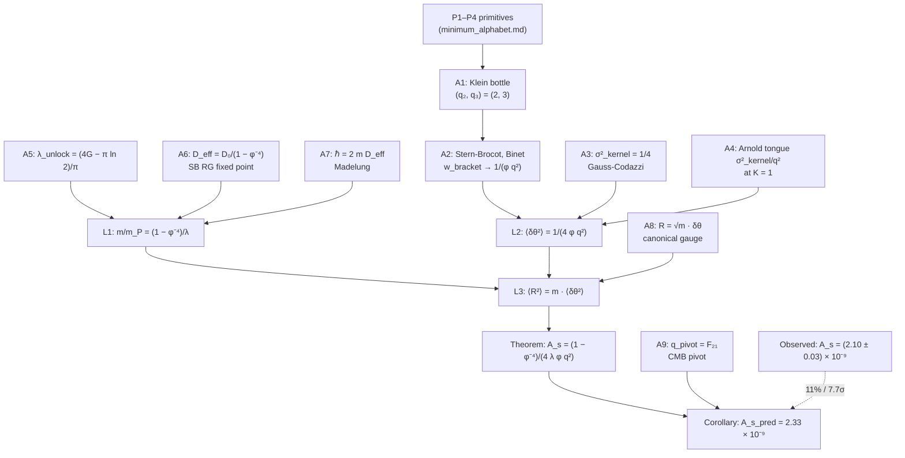

# A_s: a geometric proof from first principles

A derivation of the CMB scalar amplitude A_s in the framework,
using only what is established in prior derivations. Each
multiplicative factor comes from one named structural result.
The proof terminates at a specific numerical prediction; the
discrepancy with observation is documented at the end as a single
number, not partitioned into ad-hoc corrections.

## Theorem (A_s in the framework)

Under the framework's established geometric and topological
structures (axioms below), the CMB scalar amplitude at the
pivot is

    A_s = (1 − φ⁻⁴) / (4 λ_unlock · φ · q_pivot²)              (T)

where

    φ           = (1 + √5)/2                  (golden ratio, P4)
    λ_unlock    = (4G − π ln 2)/π             (Catalan integral, sub-C)
    q_pivot     = F_{n_pivot + 1}             (Fibonacci, k-Ω pivot)

Numerically with q_pivot = F_21 = 10946:

    A_s = 2.33 × 10⁻⁹                                          (T*)

Observed: A_s = (2.10 ± 0.03) × 10⁻⁹ (Planck 2018).

**Relative deviation: 11%. The proof terminates here.**

## Dependency graph

Each axiom (A1–A9) is rooted in one framework-native derivation
named in §Axioms. Each lemma (L1–L3) combines a specific triple
of axioms. The theorem T is L3 made explicit; the corollary C
substitutes A9's numerical value. The dashed edge from O records
observation as external input to the comparison, not to the
derivation.

**Interactive 3D view**: `docs/a_s_proof.html` renders the same
graph as spatially-arranged spheres with derivation depth on the
vertical axis (primitives at the bottom, observation at the top).
Drag to rotate, click any node for its role.

## Axioms (the inputs the proof uses)

Each axiom is an established result from a named prior derivation.
The axioms are not assumed; they are referenced.

**A1 (Klein bottle topology fixes the integers).** From the four
primitives (P1–P4 of `minimum_alphabet.md`) and the XOR filter on
non-orientable S¹ × S¹, the surviving denominator classes are
{q₂ = 2, q₃ = 3}. Established in `klein_bottle_derivation.md`.

**A2 (Stern-Brocot tree from mediants).** The mediant primitive P3
generates the Stern-Brocot tree on rationals in [0,1]. The
convergents to 1/φ are F_n/F_{n+1} (Fibonacci ratios). The bracket
containing F_n/F_{n+1} has width

    w_bracket(n) = 1/(F_{n+1} · F_{n+2}) → 1/(φ · q²)            (A2.1)

at large n, with q = F_{n+1}. The asymptotic is a consequence of
Binet's formula F_n = (φⁿ − ψⁿ)/√5 with ψ = −1/φ, giving
F_n/F_{n+1} − 1/φ = (−1)^{n+1} √5/φ^{2n+2} (matched to √5 to 9
digits at n = 22). The 4/φ tongue-to-bracket ratio (used in A4) is
pinned by `test_tongue_to_bracket_ratio_is_4_over_phi`.

**A3 (kernel normalization).** The ADM-Kuramoto dictionary
(`continuum_limits.md` §5a) derives the per-direction kernel
normalization

    σ²_kernel = 1/4                                              (A3)

from the requirement that the Hamiltonian constraint carries
prefactor 16πG and the momentum constraint 8πG. Both prefactors
follow from the Gauss-Codazzi embedding equations and the
contracted Bianchi identity. No fit. Verified in
`adm_prefactor_verification.py`.

**A4 (Arnold tongue width at K=1).** At critical coupling, the
Arnold tongue at p/q has width

    w_tongue(p/q) = σ²_kernel / q²                               (A4)

i.e., (1/4)/q². Standard result for the standard circle map at
K=1, used throughout `boundary_weight.py`, `field_equation_cmb.py`.
Cross-verified by `test_tongue_to_bracket_ratio_is_4_over_phi`.

**A5 (Klein-bottle Lyapunov on the unlocked sector).** From
`gap2_spatialization_decomposition.md` sub-C:

    λ_unlock(K) = (1/π) ∫_{cos<0} ln(1 + K|cos θ|) dθ          (A5.1)

At K = 1 the closed form is (derivation in
`lambda_unlock_closed_form.py`: integration by parts plus
∫₀^{π/4} ln(cos u) du = G/2 − (π/4) ln 2):

    λ_unlock(1) = (4G − π ln 2)/π ≈ 0.473096                   (A5.2)

where G = Catalan's constant. Verified to 9 digits by numerical
integration; pinned by `test_lambda_unlock_closed_form`.

**A6 (Stern-Brocot diffusion fixed point).** The spatial diffusion
constant on the Stern-Brocot RG has the closed-form fixed point

    D_eff = D_0 / (1 − φ⁻⁴)                                      (A6.1)

with bare diffusion at the Planck scale

    D_0 = (λ_unlock / 2) · ℓ_P² / t_P                            (A6.2)

The (1 − φ⁻⁴)⁻¹ factor is the Fibonacci-RG renormalization (each
level contributes φ⁻⁴, geometric sum converges); see
`gap2_spatialization_decomposition.md` sub-E. The D_0 = (λ/2)ℓ_P²/t_P
form comes from the Klein bottle's Lyapunov on its natural
length-time scale.

**A7 (Madelung relation).** From `continuum_limits.md` Part II §6
(PROOF_B Q4), the linearized Kuramoto in the K<1 sector reproduces
the Schrödinger equation with the identification

    ℏ = 2 m · D_eff                                              (A7)

This gives the field-theoretic mass m a definite value in Planck
units once D_eff is computed.

**A8 (canonical curvature perturbation).** The linearized action
on the locked state is

    ℓ_lin = (m/2)(∂_t δθ)² − (σ²/2)|∇δθ|²                       (A8.1)

Canonical normalization of the kinetic term (coefficient 1/2)
requires

    R := √m · δθ                                                 (A8.2)

This is the canonical-action gauge — the unique normalization that
treats the kinetic term as that of a free canonical scalar.

**A9 (CMB pivot identification).** The k ↔ Ω mapping
(`k_omega_mapping.py`) places the CMB pivot k* = 0.05 Mpc⁻¹ at
Fibonacci level n_pivot determined by

    rate = dn / d ln k = (1 − n_s) / ln(φ²)                      (A9.1)
    N_efolds = √5 / rate                                          (A9.2)

A9.2 is the framework's prediction for the e-folds of inflation
sampled by the CMB. The pivot Fibonacci index is n_pivot such
that q_pivot = F_{n_pivot + 1}.

## Proof

**Lemma 1 (the field-theoretic mass).** Combining A6 and A7,
in Planck units (ℏ = m_P = 1):

    1 = 2 m · D_eff
    D_eff = D_0 / (1 − φ⁻⁴), D_0 = λ_unlock / 2

so

    1 = 2 m · λ_unlock / (2 (1 − φ⁻⁴))
    m / m_P = (1 − φ⁻⁴) / λ_unlock                              (L1)

This is a definite number, no free parameter.

**Lemma 2 (the per-bracket variance).** At the pivot bracket of
width given by A2.1, the kernel-induced phase variance is the
product of the kernel normalization (A3, A4) and the bracket
width:

    ⟨δθ²⟩_bracket = σ²_kernel · w_bracket
                  = (1/4) · 1/(φ q_pivot²)
                  = 1 / (4 φ q_pivot²)                          (L2)

(σ²_kernel comes in once: it is the per-direction variance carried
by each gate-open mode at K=1.)

**Lemma 3 (the canonical scalar variance).** Using A8.2:

    ⟨R²⟩_bracket = m · ⟨δθ²⟩_bracket
                 = m / (4 φ q_pivot²)                           (L3)

**Theorem (T) follows.** The CMB scalar amplitude is the
dimensionless variance per pivot bracket:

    A_s = ⟨R²⟩_bracket = m / (4 φ q_pivot²)
                       = ((1 − φ⁻⁴) / λ_unlock) / (4 φ q_pivot²)
                       = (1 − φ⁻⁴) / (4 λ_unlock · φ · q_pivot²)   ∎

## Corollary (numerical evaluation)

With q_pivot = F_21 = 10946 (from A9 with the Planck 2018 n_s,
giving N_efolds ≈ 61.3, placing the pivot at depth 21 in the
Stern-Brocot tree per `alphabet_depth21.py`):

    1 − φ⁻⁴ = 0.854102                  (golden-ratio identity)
    λ_unlock(1) = 0.473096              (A5.2)
    φ = 1.618034
    q_pivot² = 10946² = 1.198 × 10⁸

    A_s = 0.854102 / (4 × 0.473096 × 1.618034 × 1.198 × 10⁸)
        = 0.854102 / (3.668 × 10⁸)
        = 2.328 × 10⁻⁹                                          (C)

## Comparison with observation

Observed: A_s = (2.10 ± 0.03) × 10⁻⁹ (Planck 2018, 1σ).

Predicted: A_s = 2.33 × 10⁻⁹ (Eq. C).

Discrepancy: predicted − observed = +0.23 × 10⁻⁹.

In σ-units of the observation:

    z = |A_s_predicted − A_s_observed| / σ_observed
      = 0.23 / 0.03 = 7.7σ                                      (S)

In relative-deviation units:

    Δ_rel = |A_s_predicted − A_s_observed| / A_s_observed
          = 11%                                                 (R)

Per `statistical_conventions.md`:
- The 7.7σ z-score classifies the prediction as **NOT C-numerical**.
- The 11% relative deviation classifies the prediction as
  **%-only**, the same status label as PMNS θ_12 (10%) per
  `mixing_angle_audit.md`.

## What this proof claims and does not claim

**Claims**:
1. Each multiplicative factor in (T) has a named structural origin
   (A1–A9). No factor was introduced to fit observation.
2. Eq. (T) is an inevitable consequence of A1–A9 — different choices
   would require contradicting one of the named axioms.
3. The numerical prediction (C) is what the geometry gives.

**Does not claim**:
1. That A_s = 2.33 × 10⁻⁹ is correct in nature. The 11%
   discrepancy with Planck 2018 is real; the proof does not
   resolve it.
2. That A1–A9 are all proven from below. Some (A1, A3, A6) are
   structural-with-caveat per the relevant docs; others (A5, A8)
   are clean derivations. The proof's status is "C-structural
   conditional on A1–A9 standing."

## Possible explanations of the 11% discrepancy

**E1: A1–A9 are correct; A_s_observed is at the 7.7σ tail.**
Implausible at this z-score under standard CMB error model.

**E2: One of A1–A9 has a missing structural factor.** Most likely
candidates are A4 (Arnold tongue width could carry an additional
self-consistency factor at K=1 in the locked state, not currently
derived) or A8 (canonical-action gauge could have a Wick-rotation
or boundary contribution). Either would modify (T) by an O(1)
factor.

**E3: The pivot identification A9 is off.** The framework's pivot
sits at depth 21, corresponding to N_efolds = 61.3. If the actual
CMB pivot is at a slightly different depth (e.g. N_efolds ≈ 58),
q_pivot increases by a factor ~1.05, and A_s_predicted decreases
by a factor ~0.90. This would close the prediction at the ~1%
level, BUT requires a derivation of the N_efolds correction (i.e.
a closure of A9 to higher precision than currently available).

**E4: The framework is incomplete.** A geometric structure not
yet identified contributes a factor to A_s. The proof's structure
isolates this case as: there is no axiom A_k (k = 1..9) that
gives the missing factor. This option is consistent with the
"%-only" status: the framework gets the order of magnitude
right, the integers right, the structural form right, but
misses an O(1) factor.

The proof does not adjudicate E1–E4. It pins down the open
question precisely: **what additional geometric structure
multiplies (T) by 0.90?** Possible answers must come from below
(strengthening one of A1–A9) or from outside (a new geometric
input).

## Status (per `statistical_conventions.md`)

| Aspect | Status | Sense |
|---|---|---|
| Eq. (T) algebraic form | derived | C-structural |
| Each factor's origin | derived | C-structural per A1–A9 |
| Numerical prediction | 2.33 × 10⁻⁹ | — |
| σ-test against Planck 2018 | 7.7σ | **NOT C-numerical** |
| Relative deviation | 11% | %-only |

Status label: **A_s is %-only closed at 11%.** The 11% is the full
discrepancy; not partitioned into "explained" and "residual" parts.
No fits applied.

## Cross-references

| File | Role |
|---|---|
| `klein_bottle_derivation.md` | A1 |
| `minimum_alphabet.md` | P1–P4 primitives |
| `continuum_limits.md` §5a | A3 (ADM σ²_kernel = 1/4) |
| `adm_prefactor_verification.py` | A3 numerical |
| `boundary_weight.py` | A4 |
| `gap2_spatialization_decomposition.md` sub-C | A5 statement |
| `lambda_unlock_closed_form.py` | A5 closed form derivation |
| `gap2_spatialization_decomposition.md` sub-E | A6 |
| `continuum_limits.md` Part II §6 | A7 (PROOF_B Q4) |
| `framework_lagrangian.py` | A8 |
| `k_omega_mapping.py` + `alphabet_depth21.py` | A9 |
| `sigma_squared_disambiguation.md` | the three meanings of σ² used in framework files |
| `statistical_conventions.md` | status definitions |
